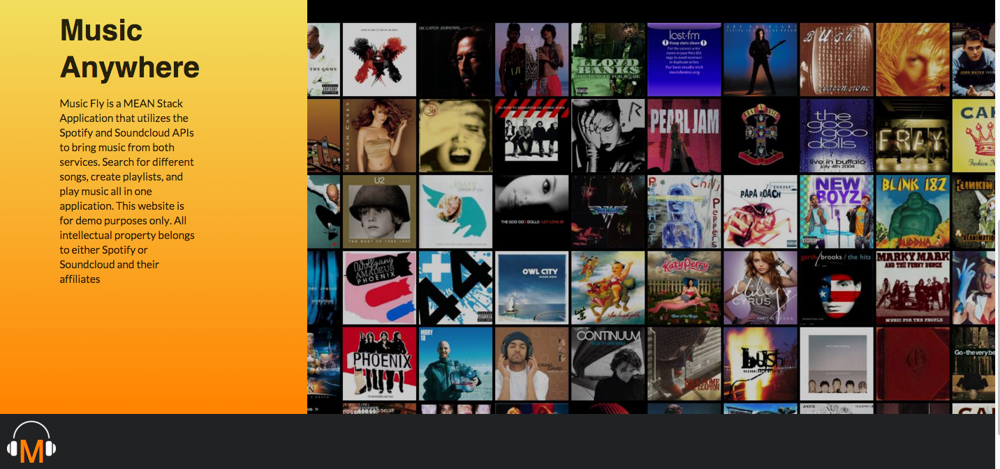
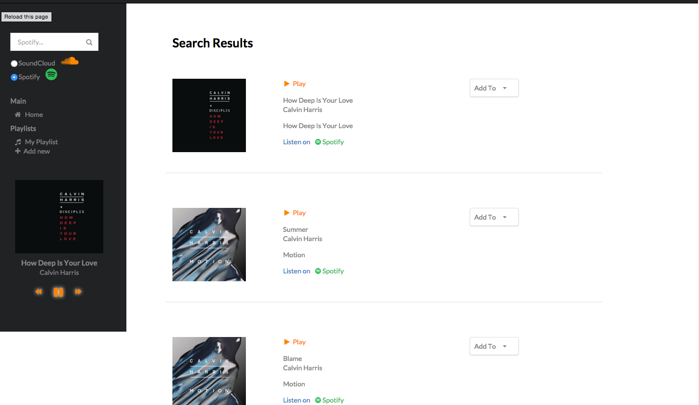

# music-fly
An application for people to play, save, and merge music files from  across different media applications.

__viewable__: https://music-fly.herokuapp.com/

## Built Upon
- Javascript
- Angular.js
- Node.js with Express
- Underscore.js
- Semantic UI
- SASS
- Gulp
- Spotify and SoundCloud API

###Summary###
Music Fly is an application that aims to bring music streaming from different platforms into one cohesive player. The application uses the Spotify and SoundCloud API for users to search for desired songs that can be stored in playlists created by the user. All songs can also be played using a responsive audio player than can play, pause, and skip songs in any given track list. the application also utilizes the Annyang JavaScript library for voice commands, currently seach and start commands are supported. If your computer has microphone support simply say "search \*track*" to find a song and "start" to run the current track list.

In the near future I am planning on adding features for users to create an account and save playlists for future log ins. All client side features were built with Angular.js and the server side was built using Node.js with Express.
**_All songs belong to either Spotify or Soundcloud and any of their affiliates_**

###Home###

###Player Menu###

